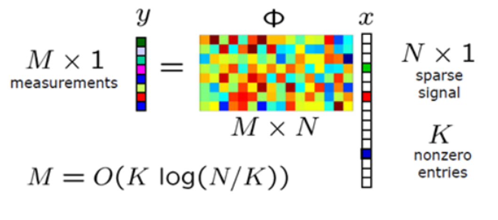
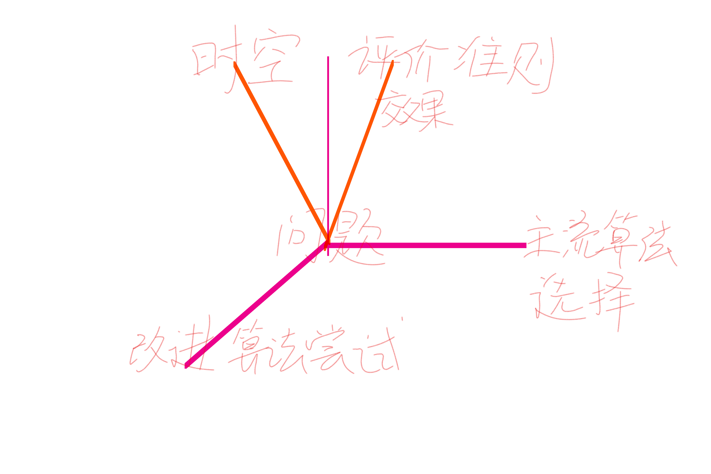
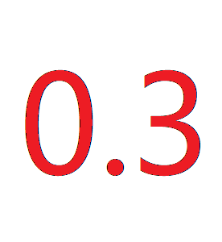
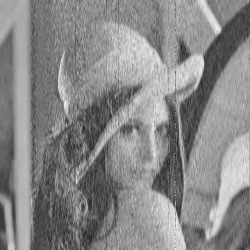
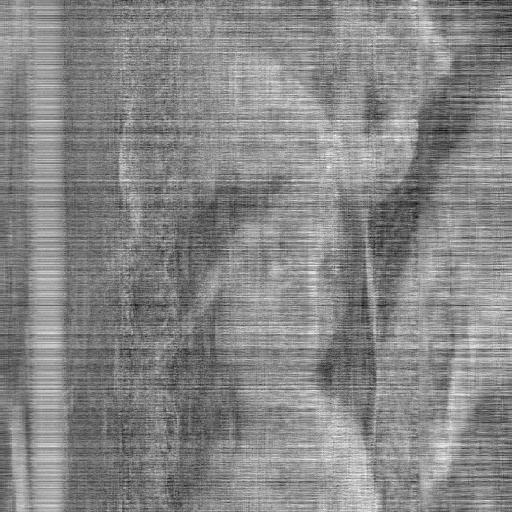
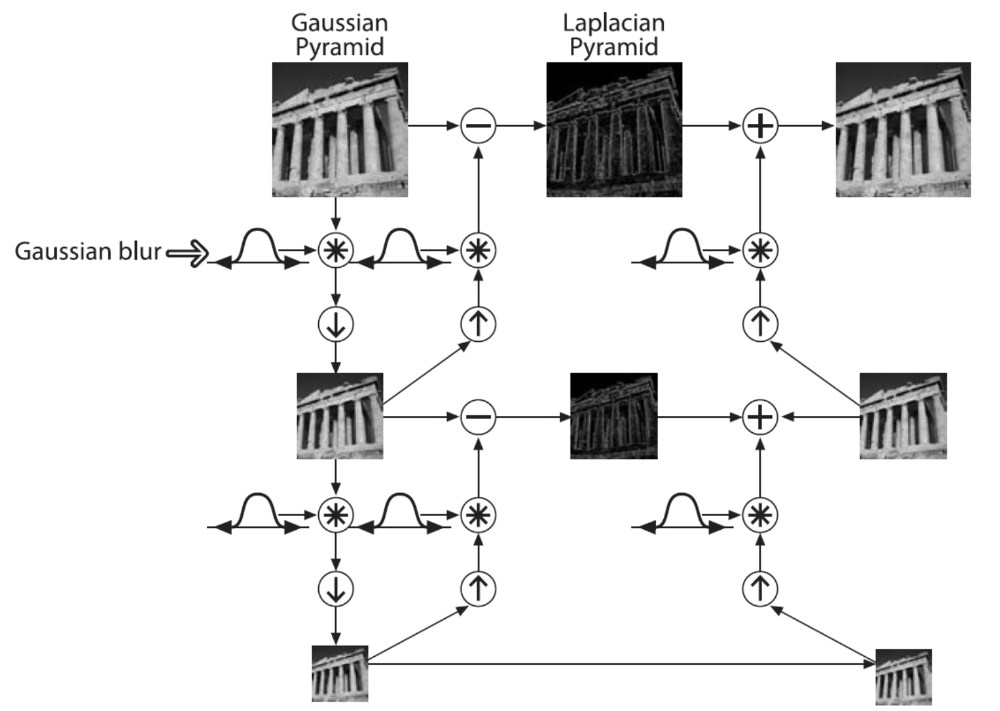
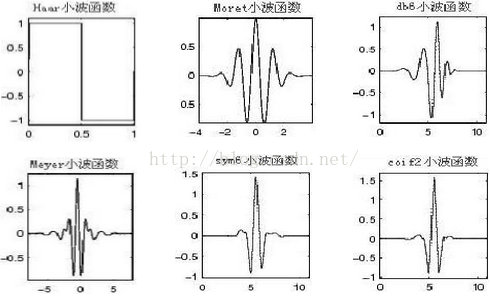
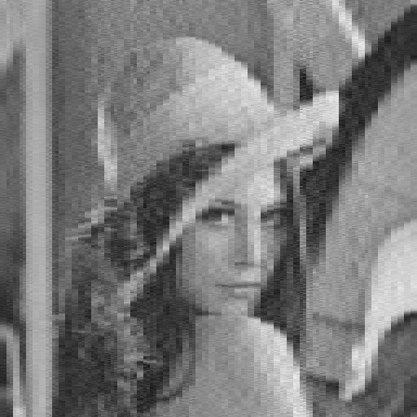

## 压缩感知

-  X: 原始的数字信号
-  Y: 压缩后的信号表示
-  $\phi$ 采集的测量矩阵(通常使用高斯核)
-  重要假设 压缩感知信号低秩(图片满足低秩特性)
-  评价准则 重构图片与原图片像素差平方和(矩阵二范数)



## 展开思路




## 三种压缩感知算法修复分析

<table><tr>
<td>

</td>
<td>

</td>
<td>

</td>
<td>

</td>
</tr></table>


### 以其中采样率为0.7时做算法间比较

比较 | IRLS | IHT | SP
:-: | :-: | :-: | :-:
耗费时间(s) | 5271.60 | 55.16 | 723.26
平均最佳迭代次数 | 196 | 4 | 7


## 优化思路一: 拉普拉斯金字塔

### 拉普拉斯金字塔原理




## 优化思路二: 小波变换

### 小波变换原理

-  所谓的小波的小是针对傅里叶波而言，傅里叶波指的是在时域空间无穷震荡的正弦（或余弦波）。
-  相对而言，小波指的是一种能量在时域非常集中的波，它的能量有限，都集中在某一点附近，而且积分的值为零，这说明它与傅里叶波一样是正交波。举一些小波的例子：




## 直接迭代VS拉普拉斯金字塔VS小波变换

<table width="95%" border="0" cellspacing="0" cellpadding="0">
<tr align="center" valign="top">
<td  width="10%">method</td>
<td  width="25%">IRLS</td><td width="5%"></td>
<td  width="25%">SP</td><td width="5%"></td>
<td  width="25%">IHT</td><td width="5%"></td></tr>
<tr align="left" valign="top">
<td  width="15%">Without Method</td><td></td><td>92.41</td><td></td><td>86.76</td><td></td><td>101.0</td></tr>
<tr align="left" valign="top">
<td  width="15%">Laplace Pyramid</td><td><td>35.99</td></td><td></td><td>39.19</td><td></td><td>35.21</td></tr>
<tr align="left" valign="top">
<td  width="15%">Wavelet</td><td></td><td>36.97</td><td></td><td>44.30</td><td></td><td>37.80</td></tr>
</table>

## 不同压缩感知算法与小波法结合情况

```{r echo=FALSE, fig.height=3.6, fig.width=4.8, message=FALSE, warning=FALSE, paged.print=FALSE}
dat1<-read.csv("IHT-smallbo-samplerate-rsquare.csv",head=F,sep=",")
dat2<-read.csv("SP-smallbo-samplerate-rsquare.csv",head=F,sep=",")
dat3<-read.csv("IRLS-smallbo-samplerate-rsquare.csv",head=F,sep=",")
plot(dat2,type="n",xlab="sampleRate",ylab="R-square")
lines(dat1,col="blue",lty=1,lwd=3)
lines(dat2,col="red",lty=2,lwd=3)
lines(dat3,col="black",lty=3,lwd=3)
legend("topright",c(dat1,dat2,dat3),c("IHT","SP","IRLS"),col=c("blue","red","black"),lwd=3)
```

<table  border="0" cellspacing="0" cellpadding="0">
<tr align="center" valign="top">
<td></td>
<td></td>
<td></td>
<td></td>
<td></td>
</tr>
<tr align="left" valign="top">
<td>66.70</td><td>53.70</td><td>37.80</td><td>38.86</td><td>18.28</td>
</tr>
</table>

## 应用

#### 压缩传输图片

#### 单像素照相机

#### 信道编码

#### 医学CT

#### 雷达成像

# Thanks

<!--
## Iamge Compressed Sensing Reconstruction

### 图像压缩感知重构

Created by 李家郡 范迪 叶睿旻 王欣悦 高林航 刘思齐
-->